# Madkour Task Documentation

## Table of Contents

1. **Introduction**
2. **Project Overview**
3. **Code Design and Architecture**
4. **Database Choice**
5. **External Dependencies**
6. **Installation and Setup**
7. **User Guides**
   - **Admin Section**
   - **Agent Section**
   - **Manager Section**
8. **Screenshots and Visuals**
9. **About the Project**
10. **Code Comments**
11. **Contact Information**

## 1. Introduction

Welcome to the documentation for Madkour Task. This document provides an in-depth understanding of our project, its purpose, architecture, and usage instructions. Madkour Task is a mobile application designed to simulate real-life scenarios for admin, agents, and managers, allowing them to interact with a database for user management.

## 2. Project Overview

Madkour Task is divided into three main sections:

- **Admin Module:** Enables admins to add new users to the database.
- **Agent Module:** Allows agents to perform various actions, such as signing in, managing customers, and submitting customers to managers.
- **Manager Module:** Empowers managers to sign in, review customer submissions, and filter non-approved customers.

## 3. Code Design and Architecture

Madkour Task follows the Model-View-Controller (MVC) design pattern for code organization. The project is divided into two main sections:

- **Core:** The core of the application.
- **Modules:** Contains three subsections: admin, agent, and manager, each with its model, view, and controller components.

## 4. Database Choice

For data storage, we opted to use the Isar database for its speed and ease of use. However, it's important to note that Isar may not provide full web support. We acknowledge this limitation and have made workarounds to ensure partial web functionality.

## 5. External Dependencies

To enhance development efficiency, we have included the following dependencies:

- **get_it:** Facilitates dependency injection for streamlined code.
- **flutter_hooks:** Offers an efficient alternative to state management with Stateless and Stateful widgets.
- **easix:** Just a handy package that i create to make my life easier.

## 6. Installation and Setup

### Running the App Locally

1. [Clone](https://github.com/Mustafa7Ibrahim/madkour_task.git) the repository.
2. Open the project in your preferred IDE (VS Code or Android Studio).
3. Run `flutter pub get` to install all dependencies.
4. Execute `flutter run` to launch the app on your device or emulator.

### Installing the App on Your Device

1. Navigate to the releases section of this repository.
2. [Download](https://github.com/Mustafa7Ibrahim/madkour_task/tree/main/releases) the latest APK file.
3. Install the APK on your device.

## 7. User Guides

### Admin Section

The admin can perform one action: adding a new user to the database.

1. Click on the floating action button in the bottom right corner.
2. Enter user details (name, role).
3. Click the "Add" button.

### Agent Section

Agents have several actions:

- Sign in.
- View their list of customers.
- Add new customers.
- Submit customers to managers.
- Check the approval status of customers.

#### Signing In as an Agent

1. Enter your username and password.
2. Click the "Sign In" button.

#### Adding a New Customer

1. Click the floating action button in the bottom right corner.
2. Enter customer details (name, birthdate, address).
3. Click the "Add" button.

#### Submitting a Customer to a Manager

1. Select the customer to submit.
2. Choose the manager for submission.
3. The customer is now submitted to the manager.

### Manager Section

Managers can:

- Sign in.
- View the list of customers submitted to them.
- Approve or disapprove customers.
- Filter non-approved customers.

#### Approving or Disapproving a Customer

1. Select the customer to approve or disapprove.
2. Click the "Approve" or "Disapprove" button.

## 8. Screenshots and Visuals

Below are screenshots of the app's user interface:

| Step 1                            | Step 2                            | Step 3                            |
| --------------------------------- | --------------------------------- | --------------------------------- |
| 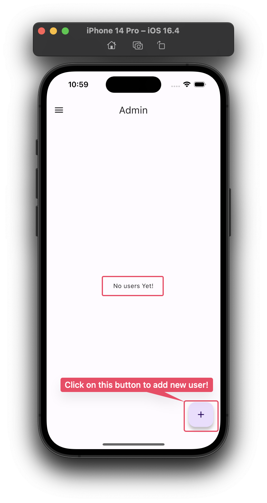 | 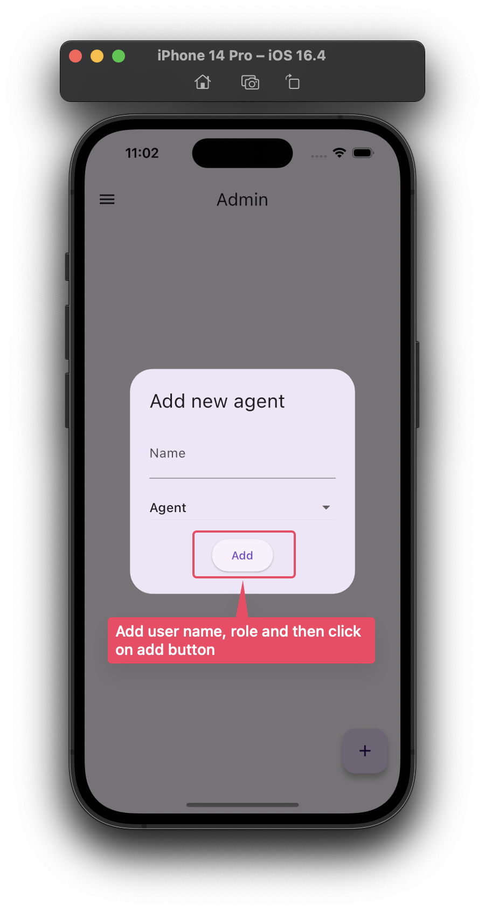 | 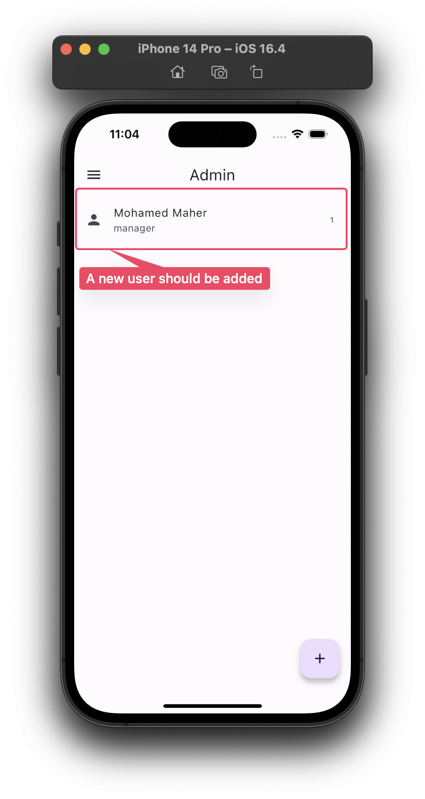 |

| Step 1                             | Step 2                             |
| ---------------------------------- | ---------------------------------- |
| 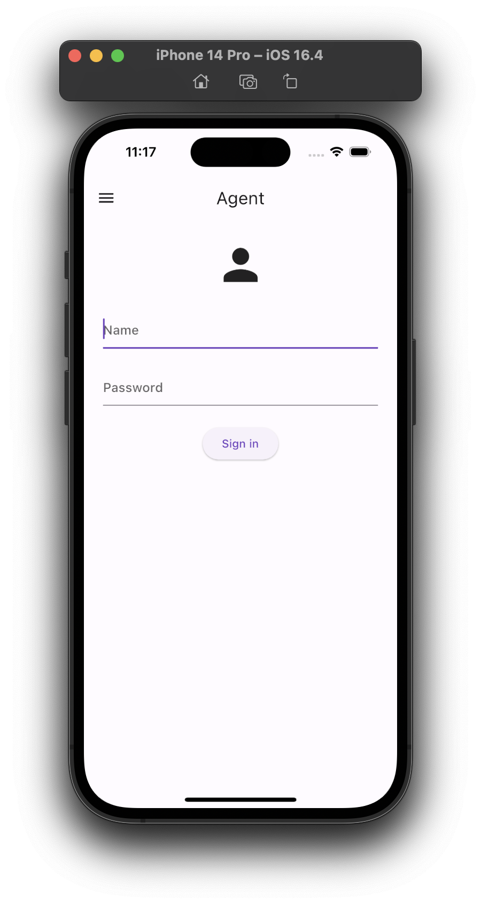 | 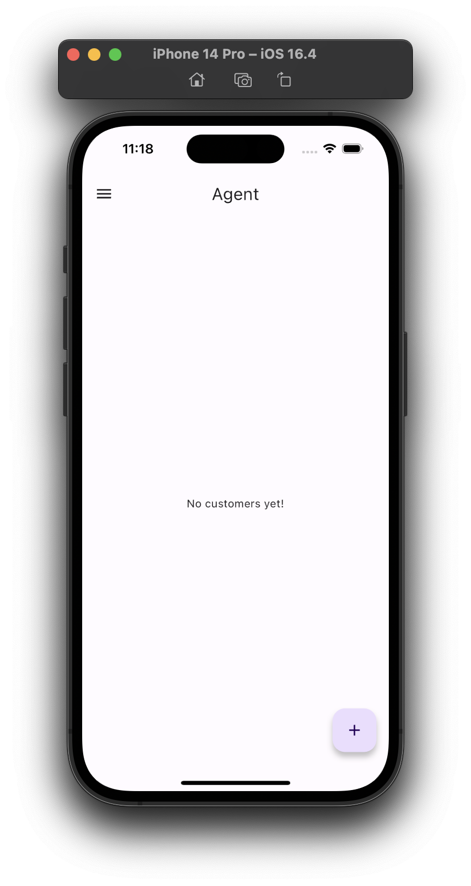 |

| Step 1                             | Step 2                             |
| ---------------------------------- | ---------------------------------- |
| 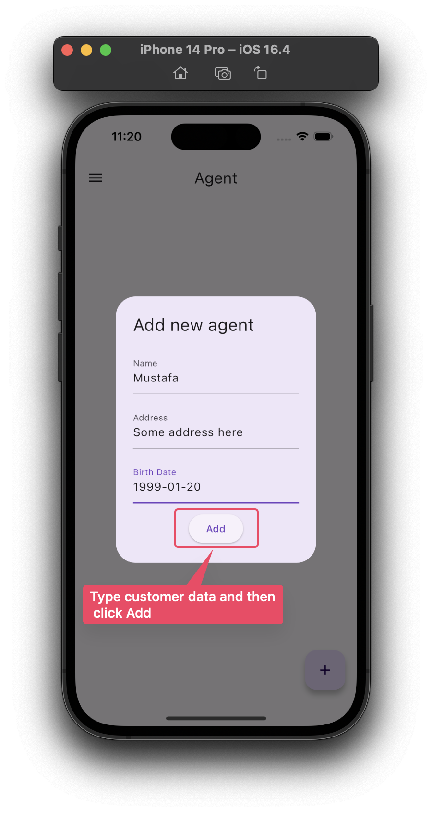 |  |

| Step 1                              | Step 2                              |
| ----------------------------------- | ----------------------------------- |
| 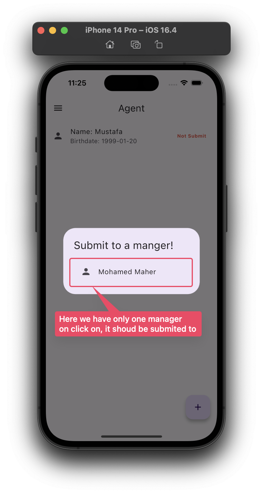 | 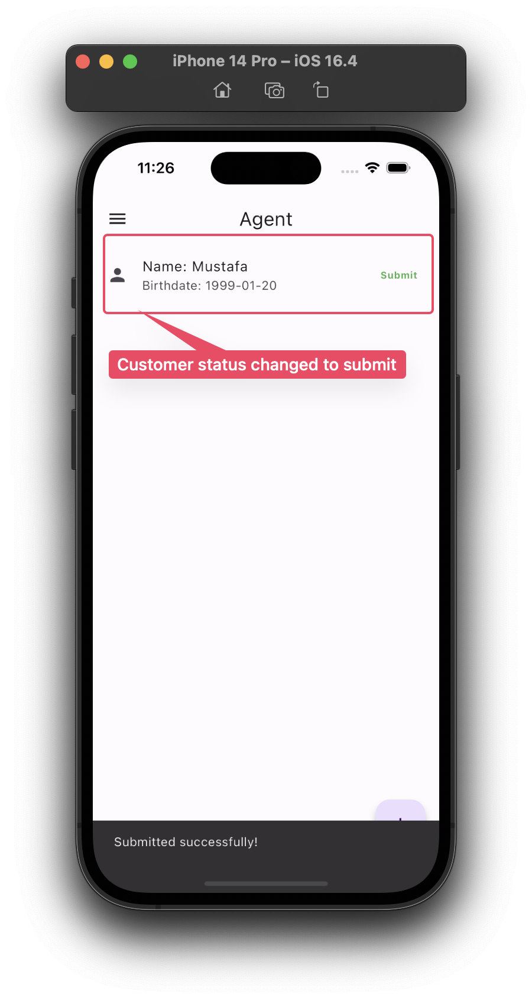 |

| Step 1                             | Step 2                             |
| ---------------------------------- | ---------------------------------- |
| 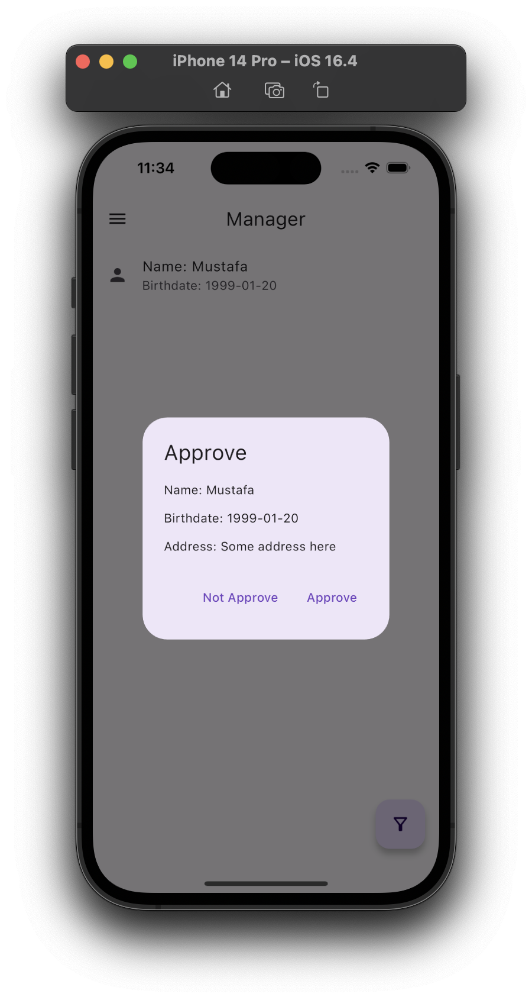 | 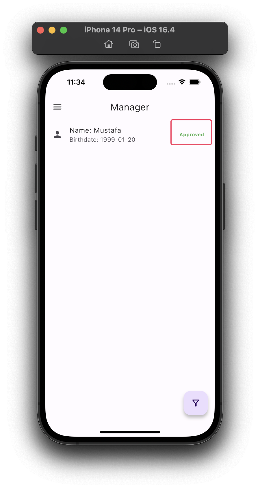 |

| screen                            | screen                            |
| --------------------------------- | --------------------------------- |
| 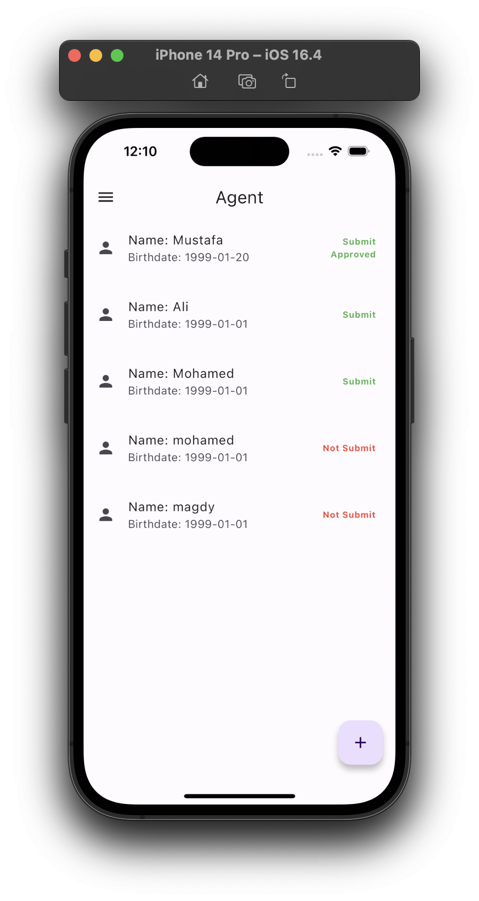 | 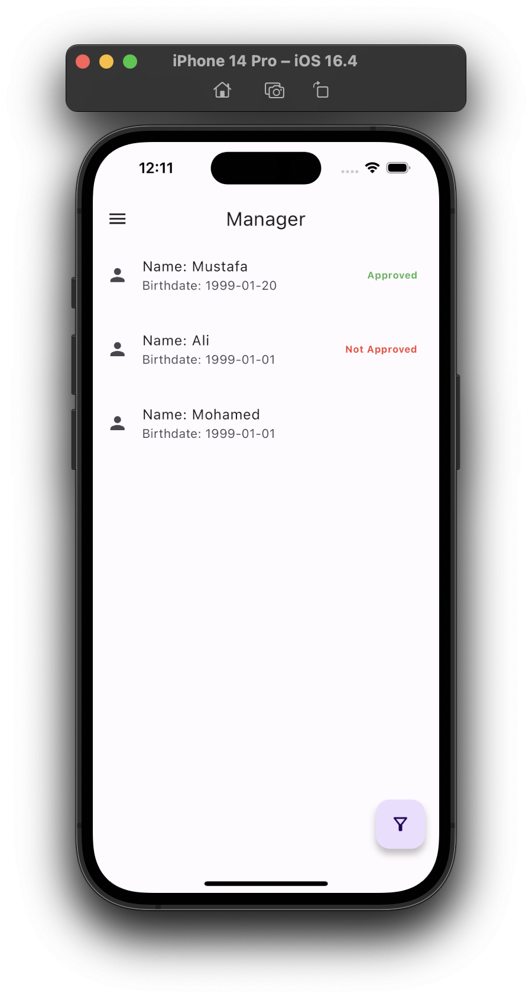 |

## 9. About the Project

- Madkour Task simulates real-life scenarios for user management.
- Agents are expected to receive notifications when their customers' statuses change, although this feature is intended for future development.
- The design is based on Material 3, following native Android design principles.
- Limited comments were added to the code for clarity; further questions can be directed to the developer.

## 10. Code Comments

While the code aims to be self-explanatory, additional comments can be added where necessary to aid understanding and future maintenance.

## 11. Contact Information

For questions or clarifications regarding this project, please contact mustafa7ibrahim@gmail.com.
